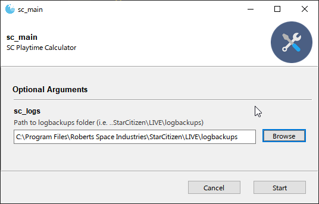

# What is it?

A quick and dirty Star Citizen total playtime calculator.  
You need to give the path to your logbackups folder and it'll do the rest.

# How to run this?

If you trust me, you can grab the exe in release and open that, then select the folder "logbackups" in your StarCitizen install. 
If you can use Python, either call sc_playtime (to use as CLI) or sc_main (to start the GUI).  

```shell
# if SC is installed in its default path of C:\Program Files\Roberts Space Industries
python -u "sc_playtime.py"
# if you need to specify the path
python -u "sc_playtime.py" --path "C:\Program Files\Roberts Space Industries\StarCitizen\LIVE\logbackups"
```

# GUI



Just select the "logbackups" folder in your SC install (if you installed it by default on C: it should work directly, otherwise you need to point at the folder which should be at `..Roberts Space Industries\StarCitizen\LIVE\logbackups`). Run the code, and then cry when you realize how much time you've been playing.


# DEVs: what's in it, what do I need to know? 

Since the stats aren't available anywhere, the only way to gather that information is by going through the log files (current session `Game.log` and past sessions in the `logbackup/*.log` files)  
The logic is basic and has pretty much no error handling. Looking for log files in logbackups, adding the Game.log one folder up, and then calculating deltas within each of those files between the first timestamp and the last one.  
This code does just that, using basic Python code + two external tools ([Fire](https://github.com/google/python-fire) to turn the code into a CLI automatically, [Gooey](https://github.com/chriskiehl/Gooey) to turn that into a GUI automatically). Exe compilation is done via [Auto-Py-to-Exe](https://github.com/brentvollebregt/auto-py-to-exe)).  
I'm not an experienced Python dev so there are probably dozens of ways this can be made cleaner - be my guest!

# License

Do whatever you want with it, it's not mine it's everybody's. Cheers.