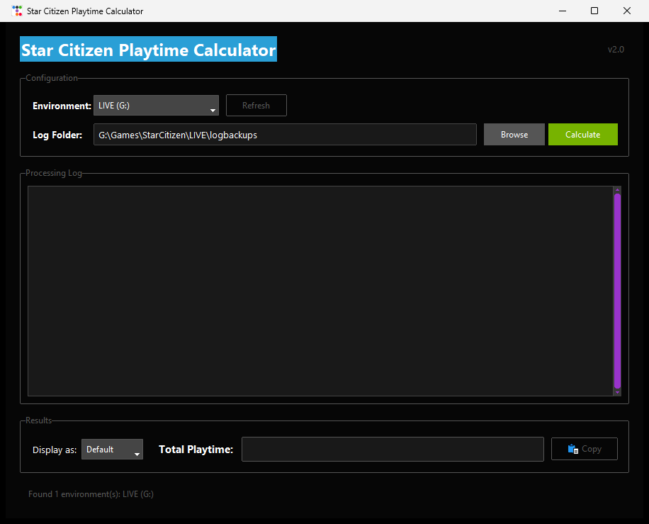
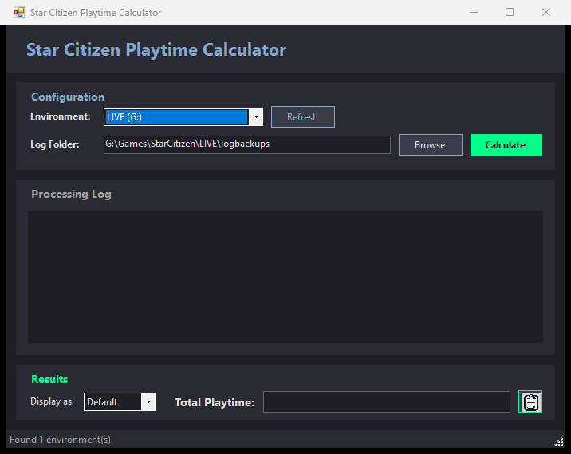

<p align="center">
  <h1 align="center">Star Citizen Playtime Calculator</h1>
  <p align="center">
    Calculate your total Star Citizen playtime by analyzing game log files.
    <br />
    <a href="https://github.com/ckuma/scplay/releases"><strong>Download Latest Release »</strong></a>
    <br /><br />
    <a href="https://github.com/ckuma/scplay/issues">Report Bug</a>
    &middot;
    <a href="https://github.com/ckuma/scplay/issues">Request Feature</a>
  </p>
</p>

<p align="center">
  <a href="https://github.com/ckuma/scplay/actions/workflows/build.yml"></a>
  <a href="https://github.com/ckuma/scplay/releases"></a>
  <a href="LICENSE.txt"></a>
</p>

---

## About

Star Citizen doesn't show your total playtime, so SCPlay computes it from the game's log files. It auto-detects your installation, sums every session across LIVE / PTU / EPTU / TECH-PREVIEW, and reports the total in days, hours, minutes, or seconds.

- **Auto-detection** — finds installs on any drive, including custom library folders (it reads the RSI Launcher log)
- **All environments** — LIVE, PTU, EPTU, TECH-PREVIEW
- **Cross-platform** — the Python build runs on Windows, Linux, and macOS
- **Per-session breakdown** with one-click copy of the result

---

## Download & Run

Grab the latest build from [**Releases**](https://github.com/ckuma/scplay/releases), unzip, and run — no installation required.

| Asset | Platform |
|-------|----------|
| `SCPlaytime-Python-Windows` | Windows (Python `.exe`) |
| `SCPlaytime-Python-Linux` | Linux (binary) |
| `SCPlaytime-CSharp-Windows` | Windows (C# WinForms `.exe`) |

> **macOS:** run the Python version from source (below).

Then pick your environment from the dropdown (auto-detected), click **Calculate**, and copy the result.

---

## Run from Source

**Python** (3.10+):

```bash
git clone https://github.com/ckuma/scplay.git
cd scplay/python
pip install -r requirements.txt
python sc_main.py        # Windows
./linux_start.sh         # Linux / macOS (chmod +x first)
```

**C#** (.NET Framework 4.8.1 — Visual Studio 2022 or Build Tools):

```bash
cd csharp
msbuild StarCitizenPlaytimeCalculator.sln /p:Configuration=Release
# or open the .sln in Visual Studio and build (Ctrl+Shift+B)
```

---

## How It Works

SCPlay scans the `logbackups` folder (plus the current `Game.log`), extracts timestamps from each file, and sums `last − first` per session:

```
<2024-11-19T14:30:00.123Z> [INFO] Client started...
<2024-11-19T16:45:30.456Z> [INFO] Client closing...
→ Session: 2 hours, 15 minutes, 30 seconds
```

**Detection** checks every fixed drive for the standard `Roberts Space Industries\StarCitizen` layout and common custom roots (e.g. `Games\StarCitizen`), and reads the RSI Launcher log (`%APPDATA%\rsilauncher\logs\log.log`) to locate installs in any custom library folder. On Linux/macOS it checks the usual Wine, Lutris, Proton, and CrossOver prefixes.

---

## Building Executables

**Python** (PyInstaller):

```bash
cd python
pip install pyinstaller==6.21.0
pyinstaller --onefile --windowed --name "SCPlaytime" \
  --add-data "resources:resources" \
  --hidden-import "PIL._tkinter_finder" \
  sc_main.py
# On Windows, use --add-data "resources;resources"
```

The `--hidden-import "PIL._tkinter_finder"` is required, or the frozen build crashes on startup.

**C#:**

```bash
cd csharp
msbuild StarCitizenPlaytimeCalculator.sln /p:Configuration=Release
```

Releases are automated: pushing a `v*` tag runs GitHub Actions, which builds all three executables and publishes a GitHub Release. Pull requests are build-validated.

---

## Screenshots

<p align="center">
  <br>
  <em>Python — cross-platform, ttkbootstrap dark theme</em>
</p>

<p align="center">
  <br>
  <em>C# — Windows, WinForms</em>
</p>

---

## Contributing

Issues and pull requests are welcome — fork, branch, commit, and open a PR.

## License

Distributed under the MIT License. See [`LICENSE.txt`](LICENSE.txt).

---

<p align="center">See you in the 'verse! o7</p>
