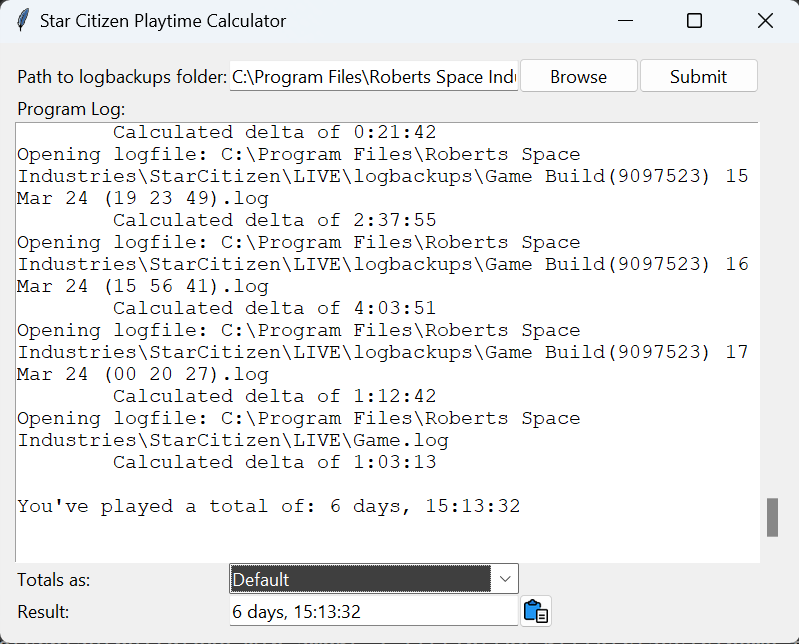
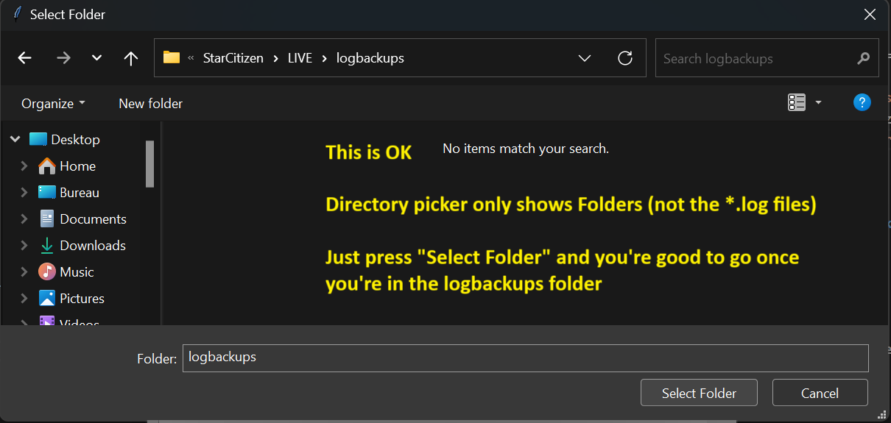

# What is it?

A quick and dirty Star Citizen total playtime calculator based on your Game logs (*.log files in SC folder).  
You need to give the path to your logbackups folder and it'll do the rest.

# How do I run this?

## Executable
If you trust me, you can grab the exe in release and open that, then select the folder "logbackups" in your StarCitizen install. You don't have to trust me if you can run the python code yourself (and even generate the executable).

## 🐧 Linux setup (manual bootstrap)

If you're on Linux, a small helper script named `linux_start.sh` can bootstrap your environment.

```bash
chmod +x linux_start.sh
./linux_start.sh
````

It will:

* Use Python 3.11 to create a virtual environment (`myenv`)
* Install dependencies from `requirements.txt`
* Launch `sc_main.py`

Make sure you have Python 3.11 and `python3.11-venv` installed:

```bash
sudo apt install python3.11 python3.11-venv
```

## Python GUI/CLI

If you can use Python, either call sc_playtime (to use as CLI) or sc_main (to start the GUI).  

```shell
# if SC is installed in its default path of C:\Program Files\Roberts Space Industries
python -u "sc_playtime.py"
# if you need to specify the path
python -u "sc_playtime.py" --path "C:\Program Files\Roberts Space Industries\StarCitizen\LIVE\logbackups"
```

# GUI



Just select the `logbackups` folder in your SC install.  

If you installed Star Citizen by default on C: everything should work directly, otherwise you need to point at the folder which should be at `..Roberts Space Industries\StarCitizen\LIVE\logbackups`.


  
If you want to see the totals as hours/minutes/etc, change the dropdown value accordingly.  
If you want to copy the text to clipboard, press the clipboard icon.

# Developpers: what do I need to know? 

**Python**: 3.11  
**Requirements.txt**:  
Fire for parsing args to CLI,  
Gooey for GUI (v1) or Tkinter in v2 (comes with Python),  
PyInstaller for standalone EXE (at the cost of being considered a trojan by a few incorrect AVs, but better than alternatives which don't pack a standalone executable..)  

Create a venv for yourself with this requirements.txt and you'll be able to run sc_playtime, sc_main, or the executable building step immediately.


## What the program does

SCPlay Iterates over logs, identifies dates and timestamps using regexps, calculates delta per-log, adds them all up. That's it.

Since the stats aren't available anywhere, the only way to gather that information is by going through the log files (current session `Game.log` and past sessions in the `logbackup/*.log` files)  

The logic is basic and has very little error handling.  
Looks for log files in logbackups, adding the `Game.log` file one folder up (most recent log), and then calculates deltas within each of those files between the first timestamp and the last one.  
This code does just that, using basic Python code + two external tools: 
- [Fire](https://github.com/google/python-fire) to turn the code into a CLI automatically, meaning you can call `python sc_playtime.py [--path "path\to\logbackups"]` 
- [Tkinter](https://docs.python.org/3/library/tkinter.html) to turn that into a GUI, then you call `python sc_main.py`
- [PyInstaller](https://pyinstaller.org/en/stable/) for the executable generation, so you can launch an executable directly

Exe compilation for more recent versions (as of 2024-03-16) done via pyinstaller:   
`pyinstaller --onefile --windowed sc_main.py`  

I'm not an experienced Python dev so there are probably dozens of ways this can be made cleaner - be my guest!

# License

Do whatever you want with it, it's not mine it's everybody's. Cheers.
